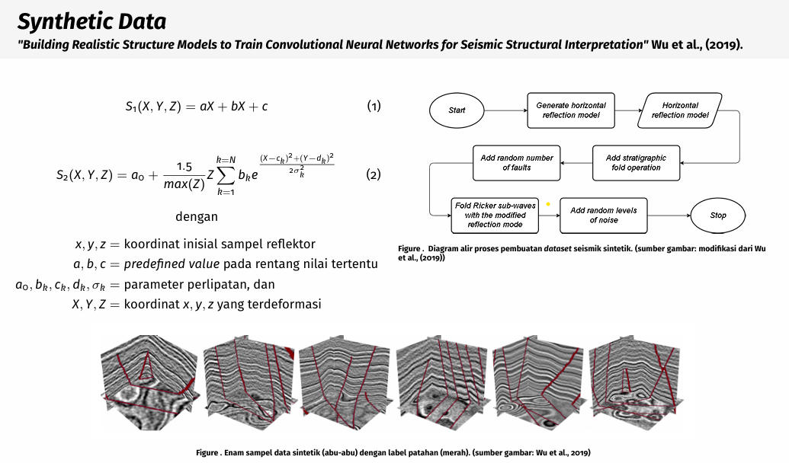

# Seismic Synthetic Data Generator written in [Odin](https://github.com/odin-lang/Odin)
> _❗❗UNDER DEVELOPMENT❗❗_

3D Synthetic seismic generator to build synthetic data, mainly for
deep learning training. Mathematically define by combination of
linear and non linear functions to create geological model of shearing
and folding developed by Wu, et al., (2019) "_Building realistic structure
models to train convolutional neural networks for seismic structural
interpretation_"

The deep learning part mainly related to data and label generation.
Label in this context is geological object which is *fault*.
Faulting in this model defined by displacement field (Walsh and Watterson (1978);
Georgsen et al., (2012) on Wu et al., (2019)



The paper by Wu et al., (2019) can be found [here](https://www.researchgate.net/publication/335103802_Building_realistic_structure_models_to_train_convolutional_neural_networks_for_seismic_structural_interpretation)

## Current Progress

- [✅] Generate horizontal layers

- [✅] Folding ($S_2$)

$$
Folding_{(S2)}(X, Y, Z) = a + \frac{1.5}{max(Z)} \times Z \sum_{k=1}^{k=N} b_k \times e^{\frac{(X-c_k)^2 + (Y-d_k)^2}{2\sigma^{2}_{k}}} 
$$

- [ ] input parameters guard

- [ ] Faulting

    - [ ] parameter parser

    - [ ] the funcitions and core logic

- [ ] Saving the final result

- [ ] some visualization for the sake of clarity of basically, everything in this repo

- [ ] documentation and proper module separation

## Motivation

Why i'm making this? well simply i am in learning arc of low level language.
I code extensively in Python, the loving filthy snake of slowness, jk, i love
Python. I'm currenlty learning C-Zig-and-Odin, i kinda scared of C and found Zig
slighlty complicated, then i bumped to Odin, which i found it, kinda less scary
than those 2, and feels like Python if that makes sense.

All of the code were reproduced from this repo:
python repo: [3D-Seismic-Image-Fault-Segmentation](https://github.com/Jun-Tam/3D-Seismic-Image-Fault-Segmentation/tree/master)

## How to use

1. open your terminal
2. clone and change dir to this repo
```bash
git clone https://github.com/kelreeeeey/OdinSeismicSyntheticGenerator && cd ./OdinSeismicSyntheticGenerator
```
3. make and run

    >you can just run plain `make` or `make opti` to use `-o:speed -no-bounds-check -disable-assert` flag to build the binary

```
-> make opti && make run
odin build . -out:./bin/syndatagen.exe -o:speed -no-bounds-check -disable-assert
# odin build . -out:./bin/syndatagen.exe -o:aggressive -microarch:native -no-bounds-check -disable-assert
./bin/syndatagen.exe example_parameter.json
Reflection: 40000
Reflection[0]: 200
Done processing XY[0/40000] (0.0012511 seconds)
Done processing XY[8000/40000] (9.320025899999999 seconds)
Done processing XY[16000/40000] (18.811389999999999 seconds)
Done processing XY[24000/40000] (29.718454699999999 seconds)
Done processing XY[32000/40000] (41.0226983 seconds)
Gaussed-reflection 40000 [][]f64
Params XY[1000]: [PointXY{idx = 1000, x = 5, y = 0}], X[0]: [5], Y[0]: [0]
Layer Models: Reflection: len(40000), Layers: len(40000)
Layer Models: Reflection[0]: len(200), Layers[0]: len(200)
Creating things takes: 53.0258972 seconds
```

4. if you dont have make installed you can check [makefile](./Makefile) and choose in which way
you want to build the binary

The executable binary will be found in `./bin` subdir. This repo comes with
[example parameter](./example_parameter.json) in `.json` format. here some
breakdown:

```json
{
  "data_dim" : { // main parameters
    "patch_size": 128, // for final sampling
    "trace_size": 200, // dimension size in x-y-z direction.
    "layer_position": [ // geological layer of the model in depth/vertical/z direction
      0, 17, 30, 50, 88,
      100, 120, 130, 160, 199 ]
  },
  "folding" : { // folding parameter (see equation `Folding(S2)`)
    "a" : 5.0,
    // b,c,d and sigma should be the type of list.
    // b,c,d and sigma should have the same length, and should not
    // be empty. if lenghts do not match, will be aligned to the smallest one.
    "b" : [15.0, 5.2],
    "c" : [46.2, 36],
    "d" : [10,46],
    "sigma" : [14, 7.0]
  },
  "verbose": false
}
```

⚠️ if you want to make a new parameter, please copy the [example](./example_parameter.json) and change it.

## Reference

1. _Building realistic structure models to train convolutional neural networks for seismic structural interpretation_ (Wu, et al., 2019)
2. Python project: [3D-Seismic-Image-Fault-Segmentation](https://github.com/Jun-Tam/3D-Seismic-Image-Fault-Segmentation/tree/master)
3. [Odin-Lang](https://github.com/odin-lang/Odin)
